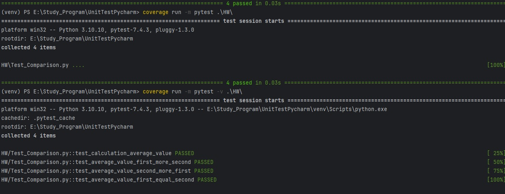
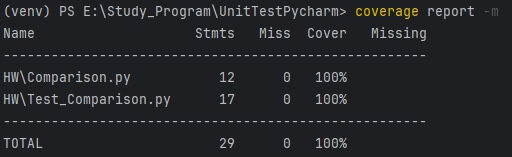
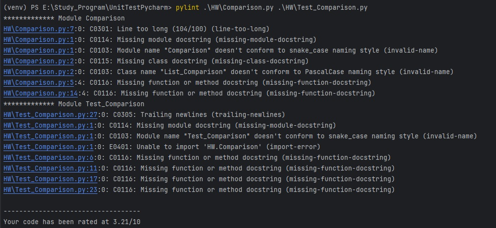
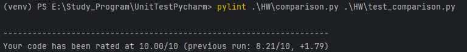

# Задание для домашней работы

### Задание 1. Создайте программу на Python или Java, которая принимает два списка чисел и выполняет следующие действия:
1. Рассчитывает среднее значение каждого списка.
2. Сравнивает эти средние значения и выводит соответствующее сообщение:
- Первый список имеет большее среднее значение, если среднее значение первого списка больше.
- Второй список имеет большее среднее значение, если среднее значение второго списка больше.
- Средние значения равны, если средние значения списков равны.

Важно:

Приложение должно быть написано в соответствии с принципами объектно-ориентированного программирования.
Используйте Pytest (для Python) или JUnit (для Java) для написания тестов, 
которые проверяют правильность работы программы. 
Тесты должны учитывать различные сценарии использования вашего приложения.
Используйте pylint (для Python) или Checkstyle (для Java) для проверки качества кода.
Сгенерируйте отчет о покрытии кода тестами. Ваша цель - достичь минимум 90% покрытия.

Формат и требования к сдаче:

Отчет о выполнении этого задания должен включать в себя следующие элементы:
- Код программы
- Код тестов
- Отчет pylint/Checkstyle
- Отчет о покрытии тестами
- Объяснение того, какие сценарии покрыты тестами и почему вы выбрали именно эти сценарии.

Для заданий, связанных с написанием кода, можно сдать в виде ссылки на GitHub или в виде архива. 
Если вы используете GitHub, убедитесь, что ваш репозиторий открытый и доступный для просмотра. 
Если вы предпочитаете отправить код в виде архива, убедитесь, что архив содержит все необходимые файлы и 
четкую инструкцию по запуску вашего кода.

Для заданий, где требуется написать текст, отчет или письменные ответы на вопросы, предоставьте ссылку на Google Docs с 
доступом на редактирование. Убедитесь, что вы поделились документом таким образом, 
чтобы у нас была возможность комментировать или предложить изменения в документе. 
Кроме того, не забудьте подписать свой документ, чтобы мы знали, от кого он пришел.

Чтобы запустить:
pylint .\HW\comparison.py .\HW\test_comparison.py Указываются только файлы 
coverage run -m pytest -v .\HW\ (флаг -v показывает файлы) Указывается все папка где есть код

# Выполнение домашней работы 

### Отчет о покрытии 

### Приведение кода к стандартам с помощью pylint 

Ошибки, которые возникли при первом запуске 

После внесения правок 

### Проведенные тесты 

В данной работе были проведены тесты на:

1. Правильность расчета среднего значения 
2. Проверка, если первый список больше второго 
3. Проверка, если первый список меньше второго 
4. Проверка, если оба списка равны